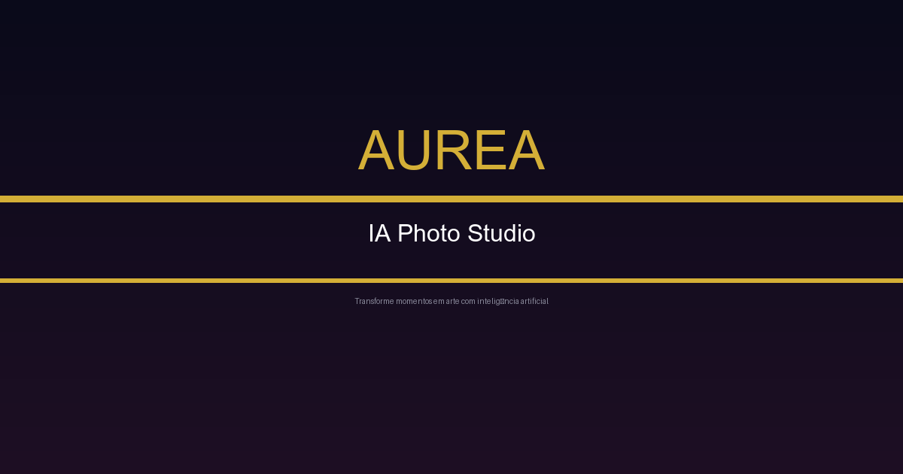

<div align="center">
  
</div>

<br/>

<div align="center">
  
  ## ✦ *A fotografia de gestante encontra a inteligência artificial* ✦
  
  **AUREA** é uma plataforma SaaS que transforma fotos de gestantes em ensaios premium com qualidade de estúdio — em segundos, sem sessão presencial, com identidade facial preservada.
  
</div>

<p align="center">
  <a href="#-stack"><strong>Stack</strong></a> ·
  <a href="#-arquitetura"><strong>Arquitetura</strong></a> ·
  <a href="#-endpoints"><strong>API</strong></a> ·
  <a href="#-setup"><strong>Setup</strong></a> ·
  <a href="#-roadmap"><strong>Roadmap</strong></a>
</p>

---

## ✦ O Problema

Estúdios fotográficos perdem clientes porque:
- Ensaios presenciais são **caros e logísticos** (locação, maquiagem, transporte)
- Clientes gestantes têm **janela curta** (24–32 semanas)
- Edição manual leva **dias ou semanas**

## ✦ A Solução AUREA

1. Cliente faz **upload de 3 fotos de referência**
2. Escolhe entre **4 estilos premium** (Estúdio Luxo, Pôr do Sol, P&B, Boho Chic)
3. IA gera ensaio completo **em segundos**
4. Cliente baixa as imagens **direto do navegador**

> **Resultado:** Redução de 80% no tempo de entrega. Margem de 90% por ensaio. Zero necessidade de estúdio físico.

---

## ✦ Stack

<div align="center">

| Camada | Tecnologia | Propósito |
|--------|-----------|-----------|
| **Frontend** | Next.js 16 + React 19 + Tailwind CSS 4 | Interface reativa e moderna |
| **Backend** | Flask 3.0 (Python 3.12) | API REST performática |
| **Banco** | PostgreSQL (Supabase) | Dados transacionais + Storage |
| **IA** | Motor proprietário de geração | Face preservation + estilos |
| **Pagamentos** | Stripe | Checkout, webhooks, créditos |
| **Fila** | Celery + Redis | Jobs assíncronos de geração |
| **Auth** | JWT + Clerk | Autenticação segura |
| **Deploy** | Render + Vercel | Serverless + edge |

</div>

---

## ✦ Arquitetura

```
┌──────────────┐     ┌──────────────┐     ┌──────────────────┐
│   Next.js    │────▶│  Flask API   │────▶│   Supabase DB    │
│  (Vercel)    │◀────│  (Render)    │◀────│  + Storage       │
└──────────────┘     └──────┬───────┘     └──────────────────┘
                            │
                     ┌──────▼───────┐     ┌──────────────────┐
                     │   Celery     │────▶│   Stripe API     │
                     │  + Redis     │     │  (Pagamentos)    │
                     └──────┬───────┘     └──────────────────┘
                            │
                     ┌──────▼───────┐
                     │   AI Engine  │
                     │  (Gerador)   │
                     └──────────────┘
```

### Fluxo de Geração

```
Upload 3 fotos → Validação facial (MediaPipe) → Escolha de estilo
       → Débito de 25 créditos → Job assíncrono (Celery)
       → IA gera 4 variações → Upload p/ Supabase
       → Notificação → Galeria do usuário
```

---

## ✦ API — Endpoints Principais

### Autenticação

| Método | Rota | Descrição |
|--------|------|-----------|
| `POST` | `/api/auth/register` | Registro de usuário |
| `POST` | `/api/auth/login` | Login (retorna JWT) |
| `GET` | `/api/auth/me` | Perfil do usuário 🔒 |
| `POST` | `/api/auth/logout` | Invalida sessão 🔒 |

### Upload e Geração

| Método | Rota | Descrição |
|--------|------|-----------|
| `POST` | `/api/upload` | Upload de imagem 🔒 |
| `GET` | `/api/styles` | Listar estilos disponíveis |
| `POST` | `/api/generate` | Iniciar geração 🔒 |
| `GET` | `/api/generate/status/<job_id>` | Status do job 🔒 |
| `GET` | `/api/gallery` | Galeria do usuário 🔒 |

### Pagamentos

| Método | Rota | Descrição |
|--------|------|-----------|
| `POST` | `/api/create-pix-payment` | Criar pagamento PIX 🔒 |
| `POST` | `/api/create-card-payment` | Criar pagamento com cartão (Checkout Pro) 🔒 |
| `GET` | `/api/payment-status/<id>` | Status do pagamento 🔒 |
| `POST` | `/api/webhooks/asaas` | Webhook Asaas (público) |

> 🔒 = Requer token JWT no header `Authorization: Bearer <token>`

---

## ✦ Setup

### Pré-requisitos

- Python 3.12+
- PostgreSQL (ou Supabase)
- Node.js 20+
- Stripe account
- Redis (para fila)

### Backend

```bash
cd backend
python -m venv venv
source venv/bin/activate  # Linux/Mac
# ou: venv\Scripts\activate  # Windows
pip install -r requirements.txt
cp .env.example .env
# Edite .env com suas credenciais
python app.py
```

### Worker (Fila)

```bash
cd backend
celery -A celery_app.celery worker --loglevel=info --pool=solo
```

### Frontend

```bash
cd frontend
npm install
npm run dev
```

### Variáveis de Ambiente Essenciais

| Variável | Descrição |
|----------|-----------|
| `DATABASE_URL` | PostgreSQL (Supabase) |
| `SECRET_KEY` | Chave secreta Flask |
| `ASAAS_API_KEY` | API Key do Asaas |
| `ASAAS_WALLET_ID` | Wallet ID (split de pagamento) |
| `ASAAS_SANDBOX` | `True` para sandbox, `False` para produção |
| `ASAAS_WEBHOOK_TOKEN` | Token de validação do webhook (opcional) |
| `AI_PROVIDER_API_TOKEN` | Token do motor de IA |
| `SUPABASE_URL` | URL do Supabase |
| `SUPABASE_KEY` | Anon key do Supabase |
| `SENDGRID_API_KEY` | (opcional) Email |

---

## ✦ Roadmap

- [x] Autenticação JWT + Clerk
- [x] Upload com validação facial
- [x] Geração com 4 estilos premium
- [x] Asaas checkout (PIX + cartão)
- [x] Galeria + download
- [x] Admin (stats, usuários, créditos)
- [x] Segurança (CORS, rate limit, Talisman)
- [ ] Catálogo público de estilos
- [ ] Compartilhamento social
- [ ] Plano de assinatura mensal
- [ ] App mobile (React Native)
- [ ] Marketplace de estilos (comunidade)
- [ ] Análise de fotos com IA

---

## ✦ Licença

**AUREA** © 2026 — Todos os direitos reservados.

<p align="center">
  <sub>Feito com ❤️ e muito café • <a href="https://aureaia-saas.vercel.app">aureaia.com</a></sub>
</p>
